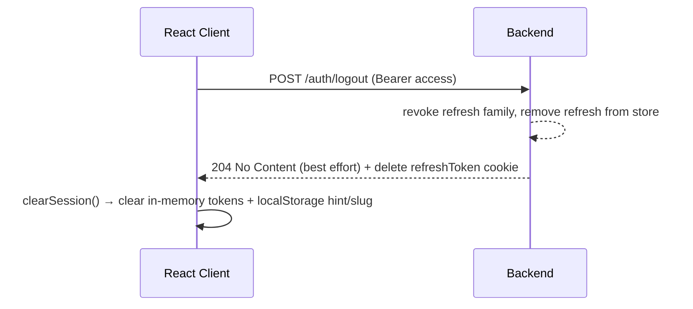

# Auth Flow — JWT Lifecycle, Refresh Rotation, Logout Cleanup

> **Status:** Accepted · **Scope:** Shared (backend issues, frontend consumes)
> This is the single source of truth for how tokens are minted, stored, refreshed, rotated, and revoked. Both `be-identity-config.md` and `fe-state-management.md` implement against this.

---

## 1. Token Model

| Token | Purpose | Lifetime | Transport | Storage |
|-------|---------|----------|-----------|---------|
| **Access token** (JWT) | Authenticates API calls (`Authorization: Bearer`) | Short — **15 min** default | body-only (`LoginResponse.accessToken`) | client **in-memory only** |
| **Refresh token** | Obtains new token pair without re-login | Long — **30 days**, sliding | `HttpOnly` cookie (`refreshToken`, `Path=/api/v1/auth`, `SameSite=Strict`) | server token store (hashed) |

**Claims on access JWT:**

```json
{
  "sub": "user-id",
  "email": "user@example.com",
  "roles": ["Admin", "Manager"],
  "iat": 1690000000,
  "exp": 1690000900,
  "jti": "unique-token-id",
  "iss": "reactauth-identity"
}
```

**Non-negotiable rules:**
- The **access token** is body-only, carries **no secret**, and must be treated as public data (sent to client). The client keeps it in memory only — it is **never** persisted to localStorage or any other script-readable store.
- The **refresh token** is **opaque**; the backend persists a hashed reference. To browsers it is delivered **only as an `HttpOnly` cookie** (`Identity.Api.Common.RefreshTokenCookie`, `Secure` except in development) — it never appears in a JSON body a script can read.
- `/auth/refresh` is cookie-authenticated: browsers send an empty body with `credentials: 'include'`. A JSON body (`{ accessToken, refreshToken }`) remains a fallback for non-browser clients; the cookie wins when present.

---

## 2. Login Flow

```mermaid
sequenceDiagram
  participant C as React Client
  participant B as Backend

  C->>B: POST /auth/login { email, password } + X-Tenant-Id: <slug>
  B-->>B: validate credentials + account lock check
  alt success
    B-->>C: 200 { accessToken, expiresIn, user } + Set-Cookie refreshToken (HttpOnly)
    C-->>C: keep accessToken in memory; set hasSession hint; persist tenantSlug
  else failure
    B-->>C: 401 INVALID_CREDENTIALS
  end
```

Post-login the client:
1. Keeps `accessToken` in memory (`auth` store) — **never** in localStorage.
2. Persists only non-secret data: `tenantSlug` and a `hasSession` boolean hint.
3. Populates the `auth` store with `LoginResponse.user`.
4. Navigates to the authorized landing route.

The refresh token arrives as the `HttpOnly` cookie set by the login response; no JavaScript ever reads it.

---

## 2b. Registration Flow

```mermaid
sequenceDiagram
  participant C as React Client
  participant B as Backend

  C->>B: POST /auth/register { email, password, firstName, lastName }
  B-->>B: validate + password policy + email uniqueness
  alt success
    B-->>C: 201 { accessToken, expiresIn, user } + Set-Cookie refreshToken (HttpOnly)
    C-->>C: keep accessToken in memory; set hasSession hint; persist tenantSlug
  else email taken
    B-->>C: 409 EMAIL_EXISTS
  else validation failure
    B-->>C: 400 VALIDATION_FAILED (field details)
  end
```

**Rules:**
- Registration **mints a token pair immediately** — same minting path as login; no separate login round-trip.
- Roles are always assigned server-side (`["User"]`); the client cannot request roles.
- Rate-limited per IP → `429 TOO_MANY_REQUESTS`.

---

## 3. Silent Re-Auth (App Mount)

On application start (`main.ts`):
1. There is no access token in localStorage (it is never stored). If the `hasSession` hint is set, attempt `POST /auth/refresh` (cookie-authenticated, empty body) to obtain a fresh access token + user.
2. If an access token is already held in memory, call `GET /auth/me` to hydrate `user`.
3. Only if both fail → `clearSession()` and show login.

The **API client intercepts `401` once per request chain**:

```
401 → attempt single-flight refresh via the HttpOnly refresh cookie:
        POST /auth/refresh (empty body, credentials: 'include')
        → on success: store new access token → replay original request
      else:
        clearSession → redirect to /login
```

> ⚠️ **Single-flight refresh:** only one refresh request may be in-flight at a time; concurrent `401`s coalesce onto the in-flight refresh to avoid token-clobbering races. (`shared/api/client.ts` → `doRefresh`/`refreshOnce`.)

---

## 4. Refresh Rotation (Rotate + Reuse Detection)

**Rotation rule:** every successful refresh issues a **new** access token AND a **new** refresh token. The prior refresh token is immediately invalidated; the rotated refresh token is delivered as a fresh `HttpOnly` cookie.

**Reuse-abuse handling:**
- If a **revoked** refresh token is presented, the backend revokes the **entire token family** (all descendants) — forcing re-login for the user.
- This bounds the blast radius of a leaked refresh token.

**Refresh request contract:**

```text
POST /auth/refresh
- Browser: no JSON body. Authenticated by the HttpOnly `refreshToken` cookie,
  sent automatically because the client uses credentials: 'include'.
- Non-browser fallback (optional body — the cookie wins when present):
  { "accessToken": "string", "refreshToken": "string" }

response = LoginResponse body (new accessToken, expiresIn, user)
         + rotated refresh token set as a new HttpOnly cookie.
```

---

## 5. Logout & Cleanup



**Client-side guarantees:**
- `clearSession()` always runs **even if** the network call fails (`try { await api.logout() } catch {}`).
- Nulls in-memory `accessToken`/`user`; clears the `hasSession` hint and `tenantSlug` from localStorage. (No token is ever removed from localStorage because none is stored there.)

**Server-side guarantees:**
- Refresh tokens are revoked server-side, not just forgotten client-side.
- The `refreshToken` cookie is deleted on logout.
- Logout is idempotent (repeated calls with revoked token still return 204).

---

## 6. Session Expiry & Silent Degradation

| Event | Client behavior | Server behavior |
|-------|-----------------|-----------------|
| Access token expired | transparent refresh (interceptor) | `401 invalid_token`, no lock |
| Refresh token expired/rotated | `clearSession()` → `redirect /login` | `401 REFRESH_TOKEN_REVOKED` |
| Refresh token reuse | whole family revoked | revoke family, accept forced re-login |
| Account locked | block login + active sessions | revoke family, `422 ACCOUNT_LOCKED` |

**Clock-skew tolerance:** backend allows a small grace (`30s`) for `iat`/`exp` skew between client and server.

---

## 7. Security Considerations

| Concern | Mitigation |
|---------|-----------|
| XSS stealing the refresh token | `HttpOnly` refresh cookie — invisible to JavaScript, cannot be exfiltrated |
| XSS stealing the access token | access token kept **in memory only** (not localStorage); CSP (see `id-security-headers.md`) + short 15-min access TTL bound exposure |
| Refresh-cookie CSRF | `SameSite=Strict` + cookie scoped to `Path=/api/v1/auth`; login/refresh rate-limited |
| Token replay | rotation + family revocation |
| Brute-force login | rate limit `429` + lockout after N failures |
| Logout incomplete | always-revoke server-side family + delete the cookie |
| Refresh leaks | refresh never in client logs / never in URL / never in JS-readable storage |

---

## 8. Conformance Checklist

- [ ] Access TTL 15 min default (env-overridable)
- [ ] Refresh rotated on every use; family revoked on reuse
- [ ] Logout always revokes server-side and deletes the `refreshToken` cookie
- [ ] Access token body-only and never persisted to localStorage (memory only)
- [ ] Refresh token delivered as `HttpOnly` cookie (`SameSite=Strict`, `Path=/api/v1/auth`, `Secure` except dev)
- [ ] Browser `/auth/refresh` is empty-body and cookie-authenticated (`credentials: 'include'`)
- [ ] localStorage holds only `tenantSlug` + `hasSession` hint
- [ ] Single-flight refresh in the client
- [ ] Error codes match `api-contract.md` (§2)