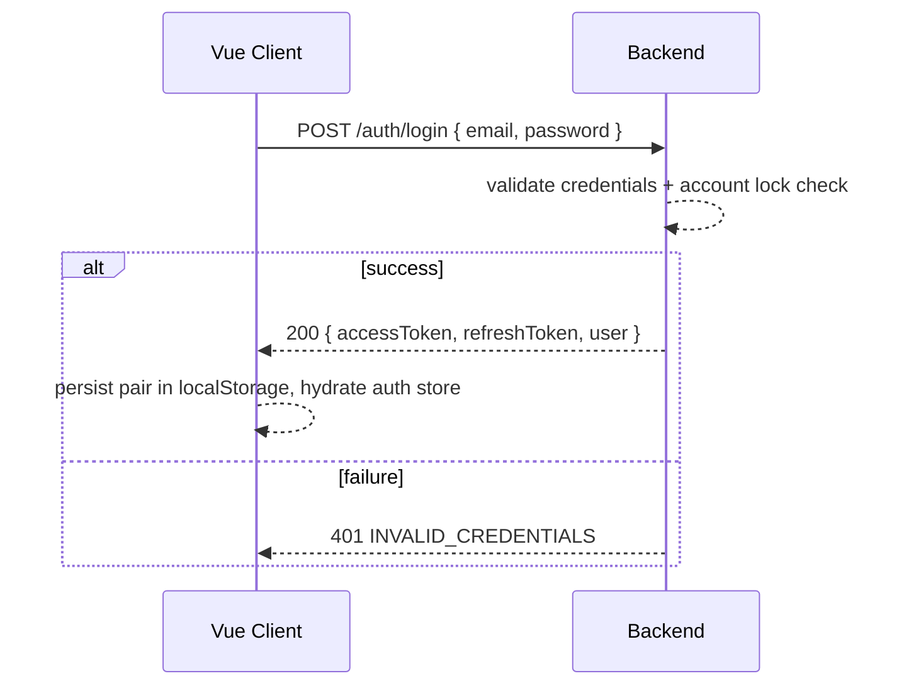
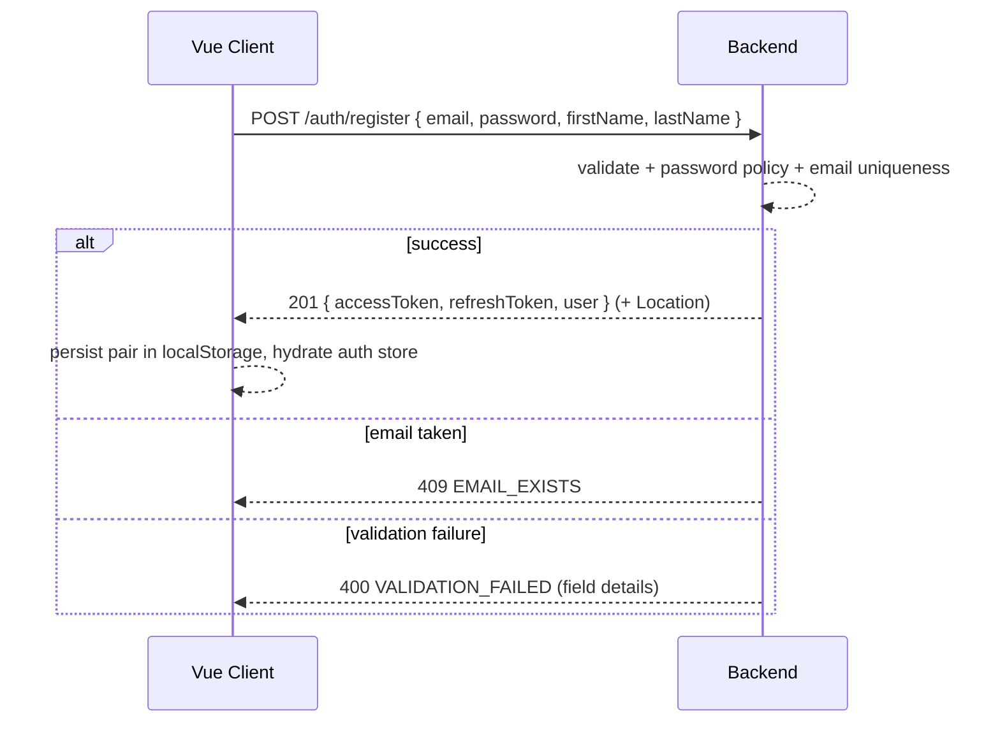
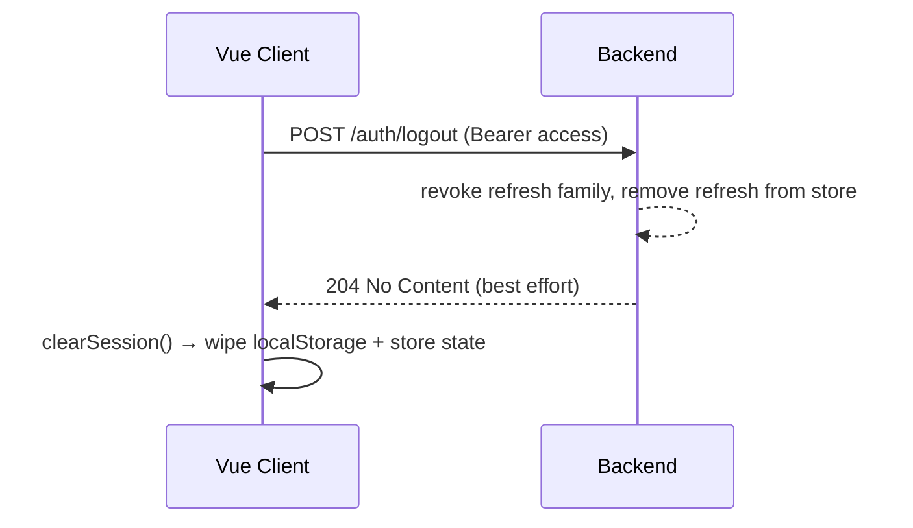

# Auth Flow — JWT Lifecycle, Refresh Rotation, Logout Cleanup

> **Status:** Draft · **Scope:** Shared (backend issues, frontend consumes)
> This is the single source of truth for how tokens are minted, stored, refreshed, rotated, and revoked. Both `be-identity-config.md` and `fe-state-management.md` implement against this.

---

## 1. Token Model

| Token | Purpose | Lifetime |
|-------|---------|----------|
| **Access token** (JWT) | Authenticates API calls (`Authorization: Bearer`) | Short — **15 min** default |
| **Refresh token** | Obtains new token pair without re-login | Long — **30 days**, sliding |

**Claims on access JWT:**

```json
{
  "sub": "user-id",
  "email": "user@example.com",
  "roles": ["Admin", "Manager"],
  "iat": 1690000000,
  "exp": 1690000900,
  "jti": "unique-token-id",
  "iss": "vueauth-identity"
}
```

**Non-negotiable rules:**
- Neither token is stored in cookies or response headers — body-only.
- Access token carries **no secret** and must be treated as public data (sent to client).
- Refresh token is **opaque by default**; the backend persists a hashed reference in its token store.

---

## 2. Login Flow



Post-login the client:
1. Stores `accessToken` + `refreshToken` (localStorage per `fe-state-management.md`).
2. Populates the `auth` store with `LoginResponse.user`.
3. Navigates to the authorized landing route.

---

## 2b. Registration Flow



**Rules:**
- Registration **mints a token pair immediately** — same minting path as login; no separate login round-trip.
- Roles are always assigned server-side (`["User"]`); the client cannot request roles.
- Rate-limited per IP → `429 TOO_MANY_REQUESTS`.
- See `features/feat-05-registration.md` for full behavior.

---

## 3. Silent Re-Auth (App Mount)

On application start (`main.ts`):
1. If `accessToken` exists in localStorage → call `GET /auth/me` to hydrate `user`.
2. If `accessToken` is expired (or `me` returns `401`) → attempt `POST /auth/refresh`.
3. Only if both fail → `clearSession()` and show login.

The **API client intercepts `401` once per request chain**:

```
401 → if refreshToken exists:
        POST /auth/refresh → save new pair → replay original request
      else:
        clearSession → redirect to /login
```

> ⚠️ **Single-flight refresh:** only one refresh request may be in-flight at a time; concurrent `401`s coalesce onto the in-flight refresh to avoid token-clobbering races.

---

## 4. Refresh Rotation (Rotate + Reuse Detection)

**Rotation rule:** every successful refresh issues a **new** access token AND a **new** refresh token. The prior refresh token is immediately invalidated.

**Reuse-abuse handling:**
- If a **revoked** refresh token is presented, the backend revokes the **entire token family** (all descendants) — forcing re-login for the user.
- This bounds the blast radius of a leaked refresh token.

**Refresh request contract:**

```json
// request
{ "accessToken": "string", "refreshToken": "string" }

// response = LoginResponse (new pair, same shape as login)
```

---

## 5. Logout & Cleanup



**Client-side guarantees:**
- `clearSession()` always runs **even if** the network call fails (`try { await api.logout() } catch {}`).
- Removes `accessToken`, `refreshToken` from localStorage; nulls `user`, token refs, dericeds derivderived flags.

**Server-side guarantees:**
- Refresh tokens are revoked server-side, not just forgotten client-side.
- Logout is idempotent (repeated calls with revoked token still return 204).

---

## 6. Session Expiry & Silent Degradation

| Event | Client behavior | Server behavior |
|-------|-----------------|-----------------|
| Access token expired | transparent refresh (interceptor) | `401 invalid_token`, no lock |
| Refresh token expired/rotated | `clearSession()` → `redirect /login` | `401 REFRESH_TOKEN_REVOKED` |
| Refresh token reuse | whole family revoked | revoke family, accept forced re-login |
| Account locked | block login + active sessions | revoke family, `422 ACCOUNT_LOCKED` |

**Clock-skew tolerance:** backend allows a small grace (`30s`) for `iat`/`exp` skew between client and server.

---

## 7. Security Considerations

| Concern | Mitigation |
|---------|-----------|
| XSS stealing localStorage token | `HttpOnly` not applicable; mitigate via CSP (see `be-security-headers.md`) + short access TTL |
| Token replay | rotation + family revocation |
| Brute-force login | rate limit `429` + lockout after N failures |
| Logout incomplete | always-revoke server-side family |
| Refresh leaks | refresh never in client logs / never in URL |

---

## 8. Conformance Checklist

- [ ] Access TTL 15 min default (env-overridable)
- [ ] Refresh rotated on every use; family revoked on reuse
- [ ] Logout always revokes server-side
- [ ] Tokens body-only (never headers/cookies)
- [ ] Single-flight refresh in the client
- [ ] Error codes match `api-contract.md` (§2)